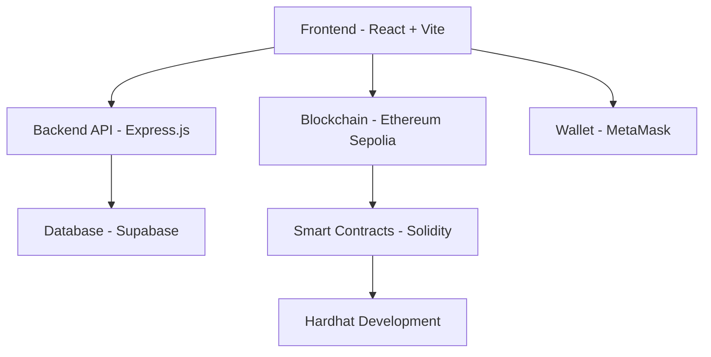
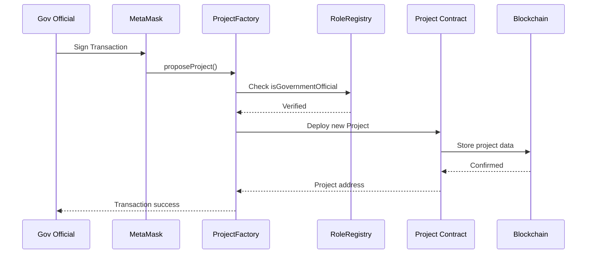
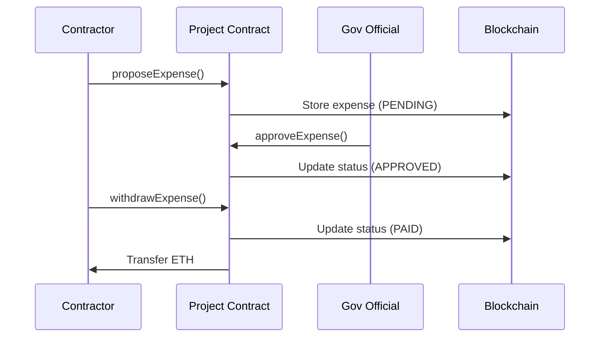
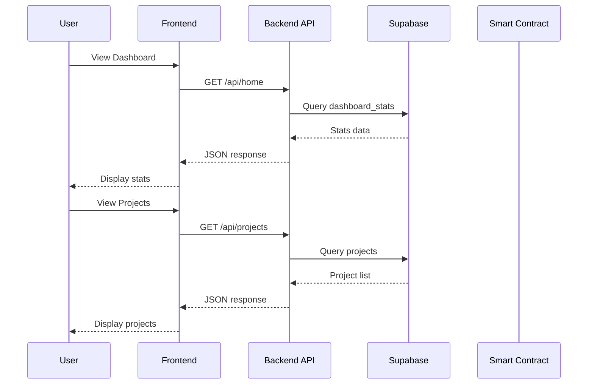

<div align="center">

# 🔗 PisoChain

### Blockchain-Powered Government Budget Transparency Platform

[](https://ethereum.org/)
[](https://soliditylang.org/)
[](https://react.dev/)
[](https://supabase.com/)

**Every Peso, Every Purpose** — Tracking every peso from allocation to impact through blockchain transparency.

[📖 Documentation](#-overview) • [🚀 Features](#-key-features) • [🏗️ Architecture](#️-system-architecture) • [⚙️ Setup](#️-installation--setup)

---

</div>

## 📋 Overview

**PisoChain** is a decentralized application (dApp) that revolutionizes transparency in government infrastructure spending by leveraging blockchain technology. Designed for the Department of Public Works and Highways (DPWH), PisoChain creates an immutable, publicly accessible ledger of budget allocations and expenditures for public infrastructure projects.

### 🎯 Objectives

- ✅ Develop a blockchain dApp that records budget allocations and expenditures
- ✅ Enable authorized government officials to record financial data
- ✅ Allow officials to approve or reject transaction requests
- ✅ Provide citizens with transparent access to transaction records
- ✅ Demonstrate blockchain's role in enforcing transparency and data integrity

---

## 🌟 Key Features

<table>
<tr>
<td width="50%">

### 🏛️ Government Officials
- Propose infrastructure projects with budgets
- Approve or reject expense requests
- Track project progress and completion
- Manage contractor assignments
- Control project status transitions

</td>
<td width="50%">

### 👷 Contractors
- Submit expense proposals
- Withdraw approved funds
- View assigned project details
- Track expense status

</td>
</tr>
<tr>
<td width="50%">

### 👥 Citizens
- View all projects in real-time
- Track budget allocations
- Monitor approved expenses
- Verify transaction integrity
- Access complete audit trail

</td>
<td width="50%">

### ⛓️ Blockchain Benefits
- **Immutable** records prevent tampering
- **Transparent** transactions for public audit
- **Secure** cryptographic verification
- **Decentralized** trust mechanism

</td>
</tr>
</table>

---

## 🏗️ System Architecture

### Technology Stack


<table>
<tr>
<th>Layer</th>
<th>Technology</th>
<th>Purpose</th>
</tr>
<tr>
<td><strong>Blockchain</strong></td>
<td>Ethereum (Sepolia Testnet)</td>
<td>Immutable ledger for transactions</td>
</tr>
<tr>
<td><strong>Smart Contracts</strong></td>
<td>Solidity ^0.8.2</td>
<td>Business logic enforcement</td>
</tr>
<tr>
<td><strong>Frontend</strong></td>
<td>React + TypeScript + Vite</td>
<td>User interface</td>
</tr>
<tr>
<td><strong>Styling</strong></td>
<td>Tailwind CSS + shadcn/ui</td>
<td>Modern, responsive design</td>
</tr>
<tr>
<td><strong>Backend</strong></td>
<td>Node.js + Express.js</td>
<td>API layer & data aggregation</td>
</tr>
<tr>
<td><strong>Database</strong></td>
<td>Supabase (PostgreSQL)</td>
<td>Off-chain data caching</td>
</tr>
<tr>
<td><strong>Web3 Library</strong></td>
<td>Ethers.js</td>
<td>Blockchain interaction</td>
</tr>
<tr>
<td><strong>Wallet</strong></td>
<td>MetaMask</td>
<td>Transaction signing</td>
</tr>
<tr>
<td><strong>Development</strong></td>
<td>Hardhat</td>
<td>Smart contract testing & deployment</td>
</tr>
<tr>
<td><strong>Hosting</strong></td>
<td>Render</td>
<td>Backend server deployment</td>
</tr>
</table>

---

## 📊 Data Model

### Smart Contract Entities

#### 🏗️ Project Contract
```
id (uint)
├── name (string)
├── projectType (string)
├── description (string)
├── location (string)
├── completionDate (string)
├── projectStatus (enum: AWAITING, ONGOING, COMPLETED)
├── contractor (address)
├── governmentOfficial (address - private)
├── projectTotalBudget (uint)
├── expenses (Expense[])
└── nextExpenseId (uint)
```

#### 💰 Expense Struct
```
expenseID (uint)
├── amount (uint)
├── contractor (address)
├── description (string)
└── status (enum: PENDING, APPROVED, REJECTED, PAID)
```

#### 👥 RoleRegistry Contract
```
isGovernmentOfficial (mapping: address => bool)
├── isContractor (mapping: address => bool)
└── admin (address)
```

### Database Entities (Supabase)

#### Projects Table
```sql
id (integer, primary key)
├── contractor (text)
├── name (text)
├── project_type (text)
├── description (text)
├── status (text)
├── location (text)
├── completion_date (date)
├── budget (numeric)
└── project_address (text)
```

#### Expenses Table
```sql
expense_id (text)
├── project_id (integer, foreign key)
├── amount (numeric)
├── contractor (text)
├── description (text)
└── status (text)
```

#### Dashboard Stats Table
```sql
id (integer, primary key)
├── total_budget (numeric)
├── num_projects (integer)
├── approved_expenses (numeric)
├── remaining_budget (numeric)
└── last_updated (timestamp)
```

---

## 🔐 Smart Contract Architecture

### Three-Contract System

#### 1️⃣ **RoleRegistry Contract**
Manages user roles and permissions across the entire system.

**Functions:**
- `registerOfficial(address)` - Admin registers government official
- `registerContractor(address)` - Admin registers contractor
- `revokeOfficial(address)` - Admin revokes official status
- `revokeContractor(address)` - Admin revokes contractor status

**Access Control:**
- Only admin can register/revoke roles
- Used by other contracts to verify permissions

---

#### 2️⃣ **Project Contract**
Individual contract deployed for each infrastructure project.

**Constructor Parameters:**
```solidity
uint _id,
address _roleRegistry,
address _official,
address _contractor,
string memory _name,
string memory _projectType,
string memory _description,
string memory _location,
string memory _completionDate
```

**Core Functions:**

**Expense Management (Contractor):**
- `proposeExpense(uint _amount, string _description)` - Submit expense request
- `withdrawExpense(uint _index)` - Withdraw approved funds

**Expense Management (Government Official):**
- `approveExpense(uint _index)` - Approve pending expense
- `rejectExpense(uint _index)` - Reject pending expense

**Project Status (Government Official):**
- `setProjectOngoing()` - Change status to ONGOING
- `setProjectCompleted()` - Change status to COMPLETED

**View Functions (Public):**
- `getAllExpenses()` - Returns all expenses for the project

---

#### 3️⃣ **ProjectFactory Contract**
Main entry point for creating and managing projects.

**Functions:**

**Project Creation (Government Official Only):**
```solidity
function proposeProject(
    address _contractor,
    string memory _name,
    string memory _projectType,
    string memory _description,
    string memory _location,
    string memory _completionDate
) public payable
```

**Query Functions (Public):**
- `getAllProjects()` - Returns array of all deployed Project contracts
- `getProjectCount()` - Returns total number of projects
- `getProjectExpenses(uint _projectID)` - Returns expenses for specific project

---

## 🎭 User Roles & Permissions

<table>
<tr>
<th>Role</th>
<th>Permissions</th>
<th>Access Level</th>
</tr>
<tr>
<td>🔧 <strong>Admin</strong></td>
<td>
- Register government officials<br>
- Register contractors<br>
- Revoke official status<br>
- Revoke contractor status
</td>
<td>Full Control (RoleRegistry)</td>
</tr>
<tr>
<td>🏛️ <strong>Government Official</strong></td>
<td>
- Propose projects with budget<br>
- Approve expenses<br>
- Reject expenses<br>
- Set project status (ONGOING/COMPLETED)
</td>
<td>Write + Read</td>
</tr>
<tr>
<td>👷 <strong>Contractor</strong></td>
<td>
- Propose expenses<br>
- Withdraw approved funds<br>
- View assigned projects
</td>
<td>Limited Write + Read</td>
</tr>
<tr>
<td>👥 <strong>Citizen</strong></td>
<td>
- View all projects<br>
- Monitor expenses<br>
- Track budget usage<br>
- Verify transactions
</td>
<td>Read Only</td>
</tr>
</table>

**Note:** The current implementation uses Government Officials for both proposal and approval functions. There is no separate "Auditor" role - government officials handle both project management and expense approval.

---

## ⚙️ Installation & Setup

### Prerequisites
```bash
Node.js >= 18.x
npm or yarn
MetaMask wallet
Git
Sepolia testnet ETH
```

### 1️⃣ Clone Repository
```bash
git clone https://github.com/yourusername/pisochain.git
cd pisochain
```

### 2️⃣ Install Dependencies
```bash
# Install frontend dependencies
cd client
npm install

# Install backend dependencies
cd ../server
npm install

# Install Hardhat dependencies
cd ../blockchain
npm install
```

### 3️⃣ Environment Setup

**Blockchain (.env)**
```env
API_URL=your_sepolia_rpc_url
PRIVATE_KEY=your_wallet_private_key
ETHERSCAN_API_KEY=your_etherscan_api_key
```

**Backend (.env)**
```env
API_URL=your_sepolia_rpc_url
PRIVATE_KEY=your_wallet_private_key
CONTRACT_ADDRESS=deployed_projectfactory_address
ROLE_ADDRESS=deployed_roleregistry_address
SUPABASE_URL=your_supabase_url
SUPABASE_KEY=your_supabase_service_key
PORT=3000
```

**Frontend (.env)**
```env
VITE_API_URL=http://localhost:3000
VITE_SUPABASE_URL=your_supabase_url
VITE_SUPABASE_ANON_KEY=your_supabase_anon_key
```

### 4️⃣ Deploy Smart Contracts

**Compile contracts:**
```bash
cd blockchain
npx hardhat compile
```

**Deploy to Sepolia testnet:**
```bash
npx hardhat run scripts/deploy.js --network sepolia
```

**Example deployment script:**
```javascript
const RoleRegistry = await ethers.getContractFactory("RoleRegistry");
const roleRegistry = await RoleRegistry.deploy();
await roleRegistry.deployed();

const ProjectFactory = await ethers.getContractFactory("ProjectFactory");
const projectFactory = await ProjectFactory.deploy(roleRegistry.address);
await projectFactory.deployed();

console.log("RoleRegistry:", roleRegistry.address);
console.log("ProjectFactory:", projectFactory.address);
```

### 5️⃣ Setup Database

**Run in Supabase SQL Editor:**
```sql
-- Projects table
CREATE TABLE projects (
  id INTEGER PRIMARY KEY,
  contractor TEXT,
  name TEXT,
  project_type TEXT,
  description TEXT,
  status TEXT,
  location TEXT,
  completion_date DATE,
  budget NUMERIC(20, 2),
  project_address TEXT
);

-- Expenses table
CREATE TABLE expenses (
  expense_id TEXT,
  project_id INTEGER REFERENCES projects(id),
  amount NUMERIC(20, 2),
  contractor TEXT,
  description TEXT,
  status TEXT,
  PRIMARY KEY (expense_id, project_id)
);

-- Dashboard stats table
CREATE TABLE dashboard_stats (
  id INTEGER PRIMARY KEY DEFAULT 1,
  total_budget NUMERIC(20, 2) DEFAULT 0,
  num_projects INTEGER DEFAULT 0,
  approved_expenses NUMERIC(20, 2) DEFAULT 0,
  remaining_budget NUMERIC(20, 2) DEFAULT 0,
  last_updated TIMESTAMP DEFAULT NOW(),
  CONSTRAINT single_row CHECK (id = 1)
);

INSERT INTO dashboard_stats (id) VALUES (1);

-- Create function to update dashboard stats
CREATE OR REPLACE FUNCTION update_dashboard_stats()
RETURNS void AS $$
BEGIN
  UPDATE dashboard_stats
  SET 
    total_budget = (SELECT COALESCE(SUM(budget), 0) FROM projects),
    num_projects = (SELECT COUNT(*) FROM projects),
    approved_expenses = (
      SELECT COALESCE(SUM(amount), 0) 
      FROM expenses 
      WHERE status = 'APPROVED' OR status = 'PAID'
    ),
    remaining_budget = (
      SELECT COALESCE(SUM(budget), 0) FROM projects
    ) - (
      SELECT COALESCE(SUM(amount), 0) 
      FROM expenses 
      WHERE status = 'APPROVED' OR status = 'PAID'
    ),
    last_updated = NOW()
  WHERE id = 1;
END;
$$ LANGUAGE plpgsql;

-- Create triggers
CREATE OR REPLACE FUNCTION refresh_dashboard_stats()
RETURNS TRIGGER AS $$
BEGIN
  PERFORM update_dashboard_stats();
  RETURN NULL;
END;
$$ LANGUAGE plpgsql;

CREATE TRIGGER projects_stats_trigger
AFTER INSERT OR UPDATE OR DELETE ON projects
FOR EACH STATEMENT
EXECUTE FUNCTION refresh_dashboard_stats();

CREATE TRIGGER expenses_stats_trigger
AFTER INSERT OR UPDATE OR DELETE ON expenses
FOR EACH STATEMENT
EXECUTE FUNCTION refresh_dashboard_stats();
```

### 6️⃣ Register Roles

**Register your addresses in RoleRegistry:**
```javascript
// Using Hardhat console or script
const roleRegistry = await ethers.getContractAt("RoleRegistry", ROLE_ADDRESS);

// Register government official
await roleRegistry.registerOfficial("0xYourOfficialAddress");

// Register contractor
await roleRegistry.registerContractor("0xYourContractorAddress");
```

### 7️⃣ Run Application
```bash
# Terminal 1 - Backend
cd server
npm run dev

# Terminal 2 - Frontend
cd client
npm run dev
```

### 8️⃣ Access Application
```
Frontend: http://localhost:5173
Backend API: http://localhost:3000
Blockchain: Sepolia Testnet
```

---

## 🚀 Usage Examples

### Register Roles (Admin)
```javascript
const roleRegistry = await ethers.getContractAt("RoleRegistry", ROLE_ADDRESS);

// Register government official
await roleRegistry.registerOfficial("0x742d35Cc6634C0532925a3b844Bc454e4438f44e");

// Register contractor
await roleRegistry.registerContractor("0x8626f6940E2eb28930eFb4CeF49B2d1F2C9C1199");
```

### Create a Project (Government Official)
```javascript
const projectFactory = await ethers.getContractAt("ProjectFactory", CONTRACT_ADDRESS);

await projectFactory.proposeProject(
  "0x8626f6940E2eb28930eFb4CeF49B2d1F2C9C1199", // contractor address
  "Metro Manila Skyway Extension",
  "Highway",
  "Extension of existing skyway infrastructure",
  "Metro Manila",
  "2026-12-31",
  { value: ethers.parseEther("1000") } // 1000 ETH budget
);
```

### Propose an Expense (Contractor)
```javascript
const project = await ethers.getContractAt("Project", projectAddress);

await project.proposeExpense(
  ethers.parseEther("50"), // 50 ETH
  "Steel reinforcement materials for Phase 1"
);
```

### Approve an Expense (Government Official)
```javascript
await project.approveExpense(0); // Approve expense at index 0
```

### Withdraw Approved Funds (Contractor)
```javascript
await project.withdrawExpense(0); // Withdraw expense at index 0
```

### Change Project Status (Government Official)
```javascript
// Start project
await project.setProjectOngoing();

// Complete project
await project.setProjectCompleted();
```

### Query Projects (Anyone)
```javascript
// Get all projects
const projects = await projectFactory.getAllProjects();

// Get project count
const count = await projectFactory.getProjectCount();

// Get project details
const projectContract = await ethers.getContractAt("Project", projects[0]);
const name = await projectContract.name();
const budget = await projectContract.projectTotalBudget();
const status = await projectContract.projectStatus();

// Get all expenses for a project
const expenses = await projectContract.getAllExpenses();
```

---

## 📁 Project Structure
```
PISO/
├── PisoChain/                     # Main project folder
│   ├── .deps/
│   │   └── remix-tests/          # Remix IDE testing artifacts
│   ├── artifacts/                # Compiled contract artifacts
│   ├── cache/                    # Hardhat cache files
│   ├── contracts/                # Solidity smart contracts
│   │   └── ProjectFactory.sol   # Main contract (RoleRegistry, Project, ProjectFactory)
│   ├── ignition/
│   │   └── modules/             # Hardhat Ignition deployment modules
│   │       └── Lock.ts
│   ├── node_modules/            # Node.js dependencies
│   ├── PisoApp/                 # React frontend application
│   │   ├── public/             # Static assets
│   │   ├── src/
│   │   │   ├── components/    # Reusable UI components
│   │   │   │   ├── ui/       # shadcn/ui components
│   │   │   │   ├── projects/ # Project-specific components
│   │   │   │   │   ├── columns.tsx
│   │   │   │   │   └── data-table.tsx
│   │   │   │   └── Navbar.tsx
│   │   │   ├── pages/        # Page components
│   │   │   │   ├── Dashboard.tsx
│   │   │   │   ├── Projects.tsx
│   │   │   │   └── About.tsx
│   │   │   ├── lib/          # Utilities & config
│   │   │   │   ├── supabase.ts
│   │   │   │   └── utils.ts
│   │   │   ├── App.tsx       # Main app component
│   │   │   ├── main.tsx      # Entry point
│   │   │   └── index.css     # Global styles
│   │   ├── .env              # Frontend environment variables
│   │   ├── package.json
│   │   ├── vite.config.ts    # Vite configuration
│   │   ├── tailwind.config.js
│   │   └── tsconfig.json
│   ├── scripts/              # Deployment & utility scripts
│   │   └── deploy.js        # Contract deployment script
│   ├── server/              # Express.js backend
│   │   ├── api/
│   │   │   ├── routes/     # API endpoints
│   │   │   │   ├── projects.js
│   │   │   │   ├── expenses.js
│   │   │   │   └── home.js
│   │   │   └── utils/      # Helper functions
│   │   │       ├── contract.js   # Blockchain interaction
│   │   │       ├── db.js         # Supabase client
│   │   │       └── sync.js       # Blockchain-DB sync
│   │   ├── server.js       # Express server entry point
│   │   ├── .env           # Backend environment variables
│   │   └── package.json
│   ├── test/               # Smart contract tests
│   │   └── Lock.ts        # Sample test file
│   ├── typechain-types/   # TypeScript contract type definitions
│   ├── .env               # Root environment variables
│   ├── .gitignore        # Git ignore rules
│   ├── hardhat.config.ts # Hardhat configuration
│   ├── package-lock.json
│   ├── package.json      # Root package dependencies
│   ├── README.md         # Project documentation
│   └── tsconfig.json     # TypeScript configuration
```

### Key Directories

| Directory | Purpose |
|-----------|---------|
| `contracts/` | Solidity smart contracts for blockchain logic |
| `PisoApp/` | React frontend application with TypeScript |
| `server/` | Express.js backend API for data aggregation |
| `scripts/` | Deployment and utility scripts |
| `test/` | Smart contract unit tests |
| `ignition/modules/` | Hardhat Ignition deployment modules |
| `typechain-types/` | Auto-generated TypeScript types for contracts |

### Configuration Files

| File | Purpose |
|------|---------|
| `hardhat.config.ts` | Hardhat network and compiler configuration |
| `tsconfig.json` | TypeScript configuration for the project |
| `PisoApp/vite.config.ts` | Vite build tool configuration |
| `PisoApp/tailwind.config.js` | Tailwind CSS styling configuration |
| `.env` files | Environment variables (not committed to Git) |

---

## 🔄 Data Flow

### Project Creation Flow


### Expense Approval Flow


### Frontend Data Flow


---

## 🛡️ Security Features

- ✅ **Role-Based Access Control** - Smart contract enforces permissions via RoleRegistry
- ✅ **Modifier Protection** - `onlyGovernmentOfficial`, `onlyContractor`, `onlyAdmin` modifiers
- ✅ **Cryptographic Signatures** - All transactions verified via MetaMask
- ✅ **Immutable Records** - Blockchain prevents data tampering
- ✅ **Balance Checks** - Contracts verify sufficient funds before transfers
- ✅ **Status Validation** - Expenses can only be approved/rejected when PENDING
- ✅ **Input Validation** - Array bounds checking and require statements
- ✅ **Secure Environment Variables** - Sensitive data protected in .env files

---

## 🧪 Testing

### Smart Contract Testing
```bash
cd blockchain
npx hardhat test
```

### Run Specific Tests
```bash
npx hardhat test test/ProjectFactory.test.js
npx hardhat test --grep "should create project"
```

### Coverage Report
```bash
npx hardhat coverage
```

### Local Blockchain Testing
```bash
# Terminal 1 - Start local node
npx hardhat node

# Terminal 2 - Deploy to local network
npx hardhat run scripts/deploy.js --network localhost

# Terminal 3 - Run tests
npx hardhat test --network localhost
```

---

## 📈 Future Enhancements

- [ ] Separate Auditor role distinct from Government Officials
- [ ] Multi-signature approval for large budgets (>₱1M)
- [ ] Integration with Philippine Government ID system (eGovPH)
- [ ] Mobile app (React Native)
- [ ] Advanced analytics and reporting dashboard
- [ ] PDF report generation for audit trails
- [ ] Email/SMS notifications for approvals
- [ ] Integration with other government agencies (DBM, COA)
- [ ] Milestone-based payment releases
- [ ] Automated compliance checking
- [ ] IPFS integration for document storage
- [ ] Mainnet deployment considerations

---

<div align="center">

### Built with ❤️ for Government Transparency

**PisoChain** • Making Every Peso Count

**Project Duration:** October - December 2025
**Scope:** Department of Public Works and Highways (DPWH)

[](https://github.com/yourusername/pisochain)
[](https://github.com/yourusername/pisochain/fork)

</div>
