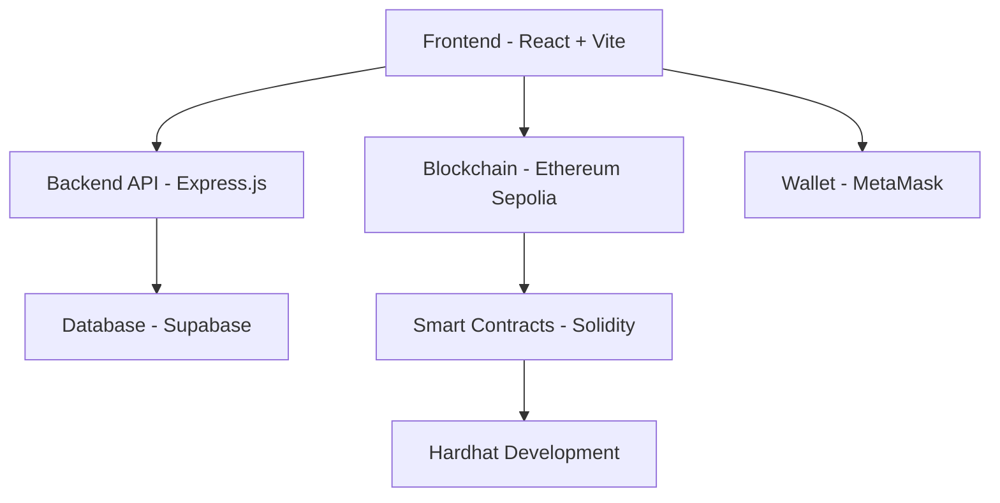
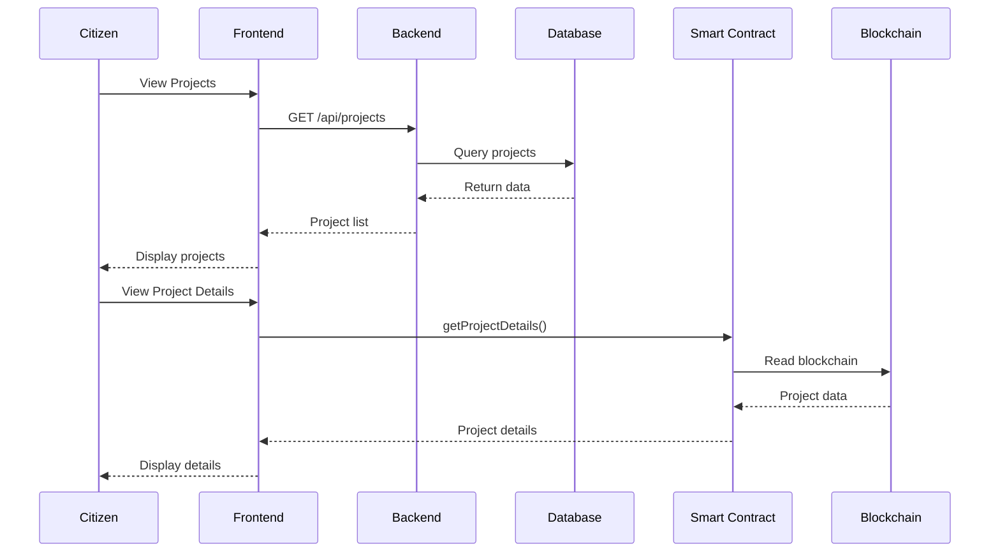

<div align="center">

# 🔗 PisoChain

### Blockchain-Powered Government Budget Transparency Platform

[](https://ethereum.org/)
[](https://soliditylang.org/)
[](https://react.dev/)
[](https://supabase.com/)

**Every Peso, Every Purpose** — Tracking every peso from allocation to impact through blockchain transparency.

[📖 Documentation](#-overview) • [🚀 Features](#-key-features) • [🏗️ Architecture](#️-system-architecture) • [⚙️ Setup](#️-installation--setup)

---

</div>

## 📋 Overview

**PisoChain** is a decentralized application (dApp) that revolutionizes transparency in government infrastructure spending by leveraging blockchain technology. Designed for the Department of Public Works and Highways (DPWH), PisoChain creates an immutable, publicly accessible ledger of budget allocations and expenditures for public infrastructure projects.

### 🎯 Objectives

- ✅ Develop a blockchain dApp that records budget allocations and expenditures
- ✅ Enable authorized government officials to record financial data
- ✅ Allow auditors to verify or reject transactions
- ✅ Provide citizens with transparent access to transaction records
- ✅ Demonstrate blockchain's role in enforcing transparency and data integrity

---

## 🌟 Key Features

<table>
<tr>
<td width="50%">

### 🏛️ Government Officials
- Propose infrastructure projects with budgets
- Submit expense requests for approval
- Track project progress and completion
- Manage contractor assignments

</td>
<td width="50%">

### 🔍 Auditors
- Review and approve/reject expenses
- Verify transaction legitimacy
- Ensure compliance with budget limits
- Monitor spending patterns

</td>
</tr>
<tr>
<td width="50%">

### 👥 Citizens
- View all projects in real-time
- Track budget allocations
- Monitor approved expenses
- Verify transaction integrity

</td>
<td width="50%">

### ⛓️ Blockchain Benefits
- **Immutable** records prevent tampering
- **Transparent** transactions for public audit
- **Secure** cryptographic verification
- **Decentralized** trust mechanism

</td>
</tr>
</table>

---

## 🏗️ System Architecture

### Technology Stack


<table>
<tr>
<th>Layer</th>
<th>Technology</th>
<th>Purpose</th>
</tr>
<tr>
<td><strong>Blockchain</strong></td>
<td>Ethereum (Sepolia Testnet)</td>
<td>Immutable ledger for transactions</td>
</tr>
<tr>
<td><strong>Smart Contracts</strong></td>
<td>Solidity</td>
<td>Business logic enforcement</td>
</tr>
<tr>
<td><strong>Frontend</strong></td>
<td>React + TypeScript + Vite</td>
<td>User interface</td>
</tr>
<tr>
<td><strong>Styling</strong></td>
<td>Tailwind CSS + shadcn/ui</td>
<td>Modern, responsive design</td>
</tr>
<tr>
<td><strong>Backend</strong></td>
<td>Node.js + Express.js</td>
<td>API layer & data aggregation</td>
</tr>
<tr>
<td><strong>Database</strong></td>
<td>Supabase (PostgreSQL)</td>
<td>Off-chain data caching</td>
</tr>
<tr>
<td><strong>Web3 Library</strong></td>
<td>Ethers.js</td>
<td>Blockchain interaction</td>
</tr>
<tr>
<td><strong>Wallet</strong></td>
<td>MetaMask</td>
<td>Transaction signing</td>
</tr>
<tr>
<td><strong>Development</strong></td>
<td>Hardhat</td>
<td>Smart contract testing & deployment</td>
</tr>
<tr>
<td><strong>Hosting</strong></td>
<td>Render</td>
<td>Backend server deployment</td>
</tr>
</table>

---

## 📊 Data Model

### Core Entities

#### 🏗️ Project
```
PROJECT_ID (Primary Key)
├── CONTRACTOR_ID (Foreign Key)
├── Project_Name
├── Project_Description
├── Project_Type
├── Project_Location
├── Completion_Date
├── Total_Budget
├── Project_Status (AWAITING, ONGOING, COMPLETED)
└── Project_Address (Blockchain)
```

#### 💰 Expense
```
EXPENSE_ID (Primary Key)
├── PROJECT_ID (Foreign Key)
├── Amount
├── Description
├── Contractor_Address
├── Status (PENDING, APPROVED, REJECTED, PAID)
└── Timestamp
```

#### 👷 Contractor
```
CONTRACTOR_ID (Primary Key)
├── Contractor_Name
├── Wallet_Address
└── Assigned_Projects[]
```

#### 🏛️ Government Official
```
OFFICIAL_ID (Primary Key)
├── Official_Name
├── Wallet_Address
├── Role (Admin, Auditor)
└── Permissions
```

---

## 🔐 Smart Contract Functions

### Project Management
- `proposeProject()` - Create new infrastructure project
- `setProjectOngoing()` - Mark project as active
- `setProjectCompleted()` - Mark project as finished
- `getAllProjects()` - Retrieve all projects
- `getProjectDetails()` - Get specific project info

### Expense Management
- `proposeExpense()` - Submit expense for approval
- `approveExpense()` - Auditor approves expense
- `rejectExpense()` - Auditor rejects expense
- `withdrawExpense()` - Contractor withdraws approved funds
- `getAllExpenses()` - Get all expenses for a project

### Query Functions
- `getProjectCount()` - Total number of projects
- `getProjectExpenses()` - Expenses for specific project
- `projectTotalBudget()` - Get allocated budget
- `projectStatus()` - Current project state

---

## 🎭 User Roles & Permissions

<table>
<tr>
<th>Role</th>
<th>Permissions</th>
<th>Access Level</th>
</tr>
<tr>
<td>🏛️ <strong>Government Official</strong></td>
<td>
- Create projects<br>
- Set budgets<br>
- Manage contractors<br>
- Update project status
</td>
<td>Write + Read</td>
</tr>
<tr>
<td>🔍 <strong>Auditor</strong></td>
<td>
- Approve expenses<br>
- Reject expenses<br>
- Verify transactions<br>
- Review compliance
</td>
<td>Write (Approval) + Read</td>
</tr>
<tr>
<td>👷 <strong>Contractor</strong></td>
<td>
- Propose expenses<br>
- Withdraw approved funds<br>
- View assigned projects
</td>
<td>Limited Write + Read</td>
</tr>
<tr>
<td>👥 <strong>Citizen</strong></td>
<td>
- View all projects<br>
- Monitor expenses<br>
- Track budget usage<br>
- Verify transactions
</td>
<td>Read Only</td>
</tr>
</table>

---

## ⚙️ Installation & Setup

### Prerequisites
```bash
Node.js >= 18.x
npm or yarn
MetaMask wallet
Git
```

### 1️⃣ Clone Repository
```bash
git clone https://github.com/yourusername/pisochain.git
cd pisochain
```

### 2️⃣ Install Dependencies
```bash
# Install frontend dependencies
cd client
npm install

# Install backend dependencies
cd ../server
npm install

# Install Hardhat dependencies
cd ../blockchain
npm install
```

### 3️⃣ Environment Setup

**Backend (.env)**
```env
API_URL=your_sepolia_rpc_url
PRIVATE_KEY=your_wallet_private_key
CONTRACT_ADDRESS=deployed_contract_address
ROLE_ADDRESS=role_registry_address
SUPABASE_URL=your_supabase_url
SUPABASE_KEY=your_supabase_key
PORT=3000
```

**Frontend (.env)**
```env
VITE_API_URL=http://localhost:3000
VITE_SUPABASE_URL=your_supabase_url
VITE_SUPABASE_KEY=your_supabase_anon_key
```

### 4️⃣ Deploy Smart Contracts
```bash
cd blockchain
npx hardhat compile
npx hardhat run scripts/deploy.js --network sepolia
```

### 5️⃣ Setup Database
```sql
-- Run in Supabase SQL Editor
CREATE TABLE projects (...);
CREATE TABLE expenses (...);
CREATE TABLE dashboard_stats (...);
-- See database schema in /docs/schema.sql
```

### 6️⃣ Run Application
```bash
# Terminal 1 - Backend
cd server
npm run dev

# Terminal 2 - Frontend
cd client
npm run dev
```

### 7️⃣ Access Application
```
Frontend: http://localhost:5173
Backend API: http://localhost:3000
```

---

## 🚀 Usage Examples

### Creating a Project (Government Official)
```javascript
await projectFactory.proposeProject(
  contractorAddress,
  "Metro Manila Skyway Extension",
  "Highway",
  "Extension of existing skyway infrastructure",
  "Metro Manila",
  "2026-12-31",
  { value: ethers.parseEther("1000") } // 1000 ETH budget
);
```

### Proposing an Expense (Contractor)
```javascript
await projectContract.proposeExpense(
  ethers.parseEther("50"), // 50 ETH
  "Steel reinforcement materials"
);
```

### Approving an Expense (Auditor)
```javascript
await projectContract.approveExpense(0); // Approve expense ID 0
```

---

## 📁 Project Structure
```
pisochain/
├── client/                 # React frontend
│   ├── src/
│   │   ├── components/    # Reusable UI components
│   │   ├── pages/         # Page components
│   │   ├── lib/           # Utilities & config
│   │   └── App.tsx
│   └── package.json
├── server/                # Express backend
│   ├── api/
│   │   ├── routes/       # API endpoints
│   │   └── utils/        # Helper functions
│   └── server.js
├── blockchain/            # Smart contracts
│   ├── contracts/        # Solidity contracts
│   ├── scripts/          # Deployment scripts
│   └── hardhat.config.js
└── docs/                 # Documentation
```

---

## 🔄 Data Flow


---

## 🛡️ Security Features

- ✅ **Role-Based Access Control** - Smart contract enforces permissions
- ✅ **Cryptographic Signatures** - All transactions verified via MetaMask
- ✅ **Immutable Records** - Blockchain prevents data tampering
- ✅ **Audit Trail** - Complete transaction history
- ✅ **Input Validation** - Both frontend and smart contract validation
- ✅ **Secure Environment Variables** - Sensitive data protected

---

## 🧪 Testing
```bash
# Run smart contract tests
cd blockchain
npx hardhat test

# Run frontend tests
cd client
npm run test

# Run backend tests
cd server
npm run test
```

---

## 📈 Future Enhancements

- [ ] Multi-signature approval for large budgets
- [ ] Integration with Philippine Government ID system
- [ ] Mobile app (React Native)
- [ ] Advanced analytics dashboard
- [ ] PDF report generation
- [ ] Email notifications for approvals
- [ ] Integration with other government agencies
- [ ] Mainnet deployment

---

## 🤝 Contributing

Contributions are welcome! Please follow these steps:

1. Fork the repository
2. Create a feature branch (`git checkout -b feature/AmazingFeature`)
3. Commit your changes (`git commit -m 'Add some AmazingFeature'`)
4. Push to the branch (`git push origin feature/AmazingFeature`)
5. Open a Pull Request

---

## 📄 License

This project is licensed under the MIT License - see the [LICENSE](LICENSE) file for details.

---

## 👥 Team

**Project Duration:** October - November 2024  
**Scope:** Department of Public Works and Highways (DPWH)  
**Target:** Government Infrastructure Transparency

---

## 📞 Contact & Support

For questions, issues, or contributions:
- 📧 Email: [your-email@example.com]
- 🐛 Issues: [GitHub Issues](https://github.com/yourusername/pisochain/issues)
- 💬 Discussions: [GitHub Discussions](https://github.com/yourusername/pisochain/discussions)

---

<div align="center">

### Built with ❤️ for Government Transparency

**PisoChain** • Making Every Peso Count

[](https://github.com/yourusername/pisochain)
[](https://github.com/yourusername/pisochain/fork)

</div>
